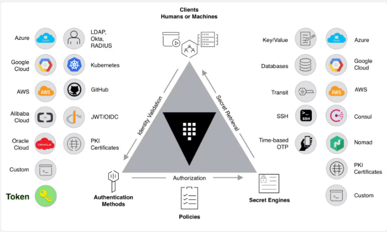
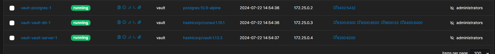
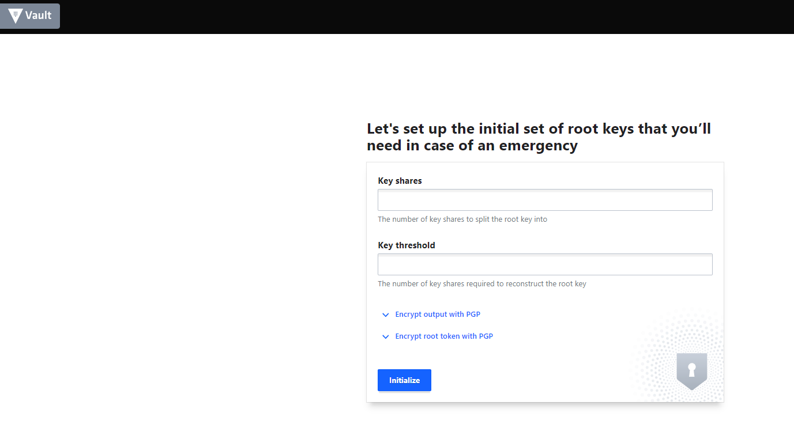
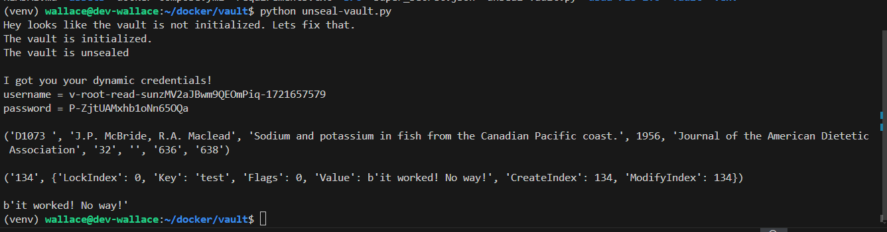

# Hashicorp Vault no Docker
O Vault server funciona como um servidor centralizado para armazenamento de dados sensíveis, tais como: senhas, certificados, chaves e muito mais.  

## Arquitetura


## Pré-requisitos
* Docker
* Instalação das dependências do Python

## Como desbloquear os pré-requitos?
### Instalação do Docker

Vídeo tutorial: https://www.youtube.com/playlist?list=PLbPvnlmz6e_L_3Zw_fGtMcMY0eAOZnN-H

## Instalação do Vault

Clone o repositório:
```
git clone https://github.com/wlcamargo/vault
```

Entre na pasta do projeto:
```
cd vault
```

Execute o comando para baixar as imagens e rodar os containers:
```
sudo docker compose up -d
```

Sample Vault running:


### Instalação das dependências do Python

Ative o ambiente virtual na pasta raiz do projeto
```
python -m venv venv
```
Acesse o ambiente virtual (Linux)
```
source venv/bin/activate
```
Instale as dependências do Python no ambiente virtual
```
pip install -r requirements.txt
```

## Uso do Vault

### Como acessar?
localhost:8200



### Faça desbloqueio do cofre
Depois de instalar as dependências, execute o script que desbloqueia o cofre que está na pasta raiz chamado ```unseal-vault.py```



### Token
O token será gerado na pasta raiz dentro do arquivo ```json``` chamado ```super_secret.json```

### Conclusão
Parabéns! O seu cofre já está pronto para o uso!

## Referências

https://www.vaultproject.io/

https://github.com/Tylerlhess/docker-vault-consul-postgres/tree/master

## Developer
| Desenvolvedor      | LinkedIn                                   | Email                        | Portfólio                              |
|--------------------|--------------------------------------------|------------------------------|----------------------------------------|
| Wallace Camargo    | [LinkedIn](https://www.linkedin.com/in/wallace-camargo-35b615171/) | wallacecpdg@gmail.com        | [Portfólio](https://wlcamargo.github.io/)   |
